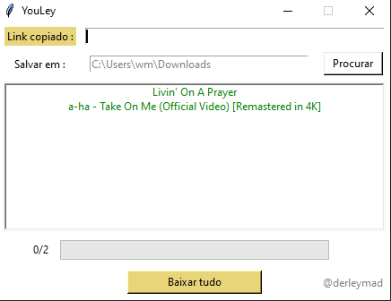

<h1 align="center">:star:Como usar:grey_question:</h1>
 
<h2 align="center">:point_right:Baixe os arquivos <a href="https://github.com/derleymad/youtube-py/releases/tag/v1.2.0">youtube-py-main:floppy_disk::point_left:</a></h2>
 

Extraia os arquivos e depois execute o YouLey.exe...Depois adicione os links, podem ser vídeos normais ou um link de uma playlist inteira, depois pressione "Enter", e por fim clique em baixar tudo

<h3 align="center">Observações:grey_exclamation:</h3>

Se seu link for uma playlist, certifique-se de o copiar corretamente, para isso a url deve conter o nome "playlist" no meio.

<h4 align="center">Restrições:exclamation:<h4>
 
Se sua música tiver restrições para idade:underage:, país :kr:, ou seja um link privado, não será possível baixar:cold_sweat:

  

